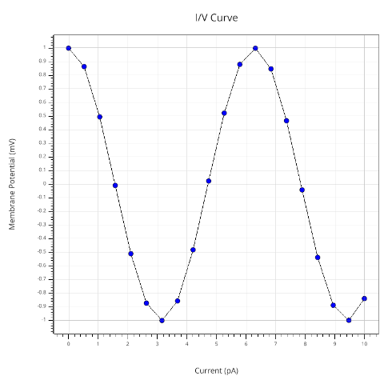

# Vispy OSMesa docker container

This is a Dockerfile that builds a docker container with OSMesa to test vispy
offscreen rendering. Running in a docker container is a nice way to test
that the osmesa vispy backend doesn't require an X server.

Quick usage :

1. Checkout the *osmesa* vispy branch (in the same directory as the run.sh script)
    ```
    git clone -b osmesa git@github.com:julienr/vispy.git
    ```

2. Start a bash shell in the container with `./run.sh`
3. Run the simple_osmesa.py example 
    ```
    python examples/offscreen/simple_osmesa.py
    ```

4. On your host machine, you should have a *vispy/osmesa.png* file that was
   created by the simple_osmesa.py script.
   
   It should look like this :
   
   

